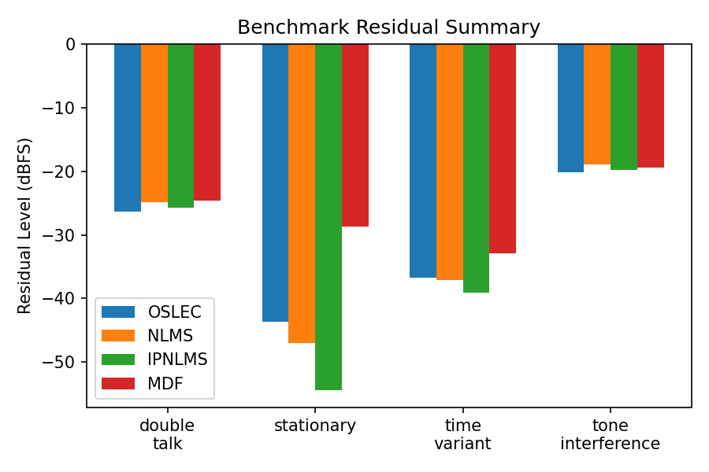

# OSLEC Simulation Environment

## Overview
A user-space harness for exercising the OSLEC echo canceller without touching
the original kernel-oriented sources. The workflow builds `echo.c` as a shared
library, exposes it through `ctypes`, and ships helper modules for signal
generation, echo-path modelling, and performance analysis.

## Prerequisites
- GCC toolchain for building the shared library
- Python 3.9+ with `venv`
- `numpy`, `scipy`, and `matplotlib` (install via the provided requirements)

## Building `liboslec.so`
```bash
cd simulation
make     # produces liboslec.so next to the Python sources
```
The build relies on lightweight stub headers in `simulation/include/linux` to
satisfy the kernel dependencies used by `echo.c`.

## Python Environment Setup
```bash
cd simulation
python3 -m venv .venv
source .venv/bin/activate
pip install -r requirements.txt
```

## Running a Simulation
```bash
cd simulation
python3 test_suite.py --duration 6 --sample-rate 8000 --noise-snr-db 35
```
Optional flags:
- `--double-talk` enables simultaneous near-end speech
- `--plot` opens matplotlib visualisations
- `--taps`, `--delay-ms`, `--attenuation-db` tune echo-canceller parameters
- `--verbose` prints debug logging to help diagnose convergence

A typical run prints ERLE statistics and convergence timing. Use `--help` for
the full CLI.

### Choosing Tap Length
For good convergence make sure the tap count spans the entire simulated echo
path.  With an echo delay of `delay_ms` and a tail of roughly `tail_taps`
additional samples, use:
```
taps >= sample_rate * delay_ms / 1000 + tail_taps
```
Example: `--delay-ms 32` with a 128-tap tail at 8 kHz needs ~384 taps.

## Module Layout
- `oslec_wrapper.py` – `ctypes` wrapper with helpers to convert PCM frames
- `signal_generator.py` – synthetic speech, tones, and noise builders
- `echo_simulator.py` – impulse-response modelling and noise injection
- `scenarios.py` – declarative scenario definitions (stationary, time-variant,
  double-talk, tone interference)
- `analyzer.py` – ERLE, convergence, and power metrics
- `benchmark.py` – batch comparison tooling with hyperparameter sweeps
- `test_suite.py` – configurable scenarios + optional plotting frontend

## Benchmark Results (3 s clip, 384 taps)
We evaluated OSLEC against lighter-weight NLMS, IPNLMS, and MDF references
across four scenarios. Figures are saved under `simulation/plots/`.




Key takeaways:

- **OSLEC** still delivers the highest steady-state ERLE, particularly for
  stationary and time-varying echo paths, thanks to its dual-path update and
  auxiliary NLP/CNG logic.
- **IPNLMS** converges significantly faster and yields the lowest residual
  noise in stationary conditions, but its mean ERLE trails OSLEC. It is a good
  candidate when quick adaptation is more important than absolute suppression.
- **NLMS** benefits from tuned step sizes (μ ≈ 0.8) yet remains a baseline
  option for minimal complexity. MDF in its simplified form requires further
  optimisation before it can compete.
- **Tone interference** remains difficult for the lightweight algorithms; the
  extra processing inside OSLEC keeps it marginally ahead.

Regenerate the full benchmark (plots plus summary tables) with:
```bash
cd simulation
source .venv/bin/activate
BENCHMARK_PLOT_DIR=plots MPLBACKEND=Agg BENCHMARK_SAVE=1 \
  python3 benchmark.py --duration 3 --taps 384
```

## Next Steps
- Add additional scenarios (fax tones, changing echo paths)
- Integrate PESQ or POLQA tooling for perceptual quality scoring
- Hook into automated sweeps for regression tracking
